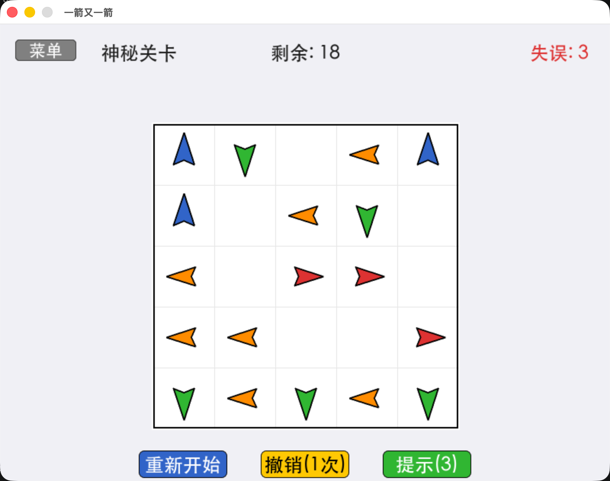

# 一箭又一箭

一款基于 Python + Pygame 的休闲解谜小游戏。观察箭头方向与相互阻挡关系，按合适的顺序点击箭头，让所有箭头依次飞出棋盘。

## 游戏简介

棋盘上摆放着若干带方向的彩色箭头（上=红、下=绿、左=蓝、右=橙）。点击某个箭头后，程序会检查该箭头朝向到棋盘边界之间的路径：

- 若路径畅通，箭头飞出棋盘并被消除；
- 若路径上有其他箭头阻挡，箭头弹回，并消耗一次失误机会；
- 清空本关所有箭头即可通关；失误次数用尽则失败。

游戏包含 3 个手工设计的关卡，以及 1 个**神秘关卡**——每局随机生成一个 5×5 棋盘（20~25 个箭头），采用逆向构造算法保证必定有解。

## 开发环境

- Python 3.10+
- Pygame 2.6+
- 操作系统：Windows / macOS / Linux

## 安装和运行

### 1. 克隆项目

```bash
git clone <repository-url>
cd one-arrow-after-another
```

### 2. 创建虚拟环境（推荐）

```bash
python3 -m venv venv
source venv/bin/activate   # macOS / Linux
# 或
venv\Scripts\activate      # Windows
```

### 3. 安装依赖

```bash
pip install -r requirements.txt
```

### 4. 运行游戏

```bash
python -m game.main
```

## 游戏操作说明

### 开始界面

- 点击 **开始游戏** 进入关卡选择。

### 关卡选择界面

- 点击 **关卡 1 / 2 / 3** 卡片开始对应关卡；
- 点击 **? 神秘关卡** 进入随机关卡；
- 点击 **返回** 回到开始界面。

### 游戏界面

- **点击箭头**：尝试让箭头沿其方向飞出棋盘；
- **菜单**：返回关卡选择（普通关卡会保存当前进度）；
- **重新开始**：重置当前关卡；
- **撤销**：撤销上一步操作（每关限 1 次）；
- **提示**：高亮一个当前可以飞出的箭头（普通关卡 1 次、神秘关卡 3 次）。

### 通关 / 失败界面

- 通关后可选择 **下一关 / 重玩本关 / 返回菜单**；
- 神秘关卡通关后可选择 **再来一局**（重新随机生成）或 **返回菜单**；
- 失败后可 **重新开始** 或 **返回菜单**。

## 游戏截图


## 功能特性

- ✅ 图形化界面（开始 / 关卡选择 / 游戏 / 通关 / 失败）
- ✅ 四种方向的彩色箭头与飞出动画
- ✅ 碰撞弹回动画 + 屏幕震动 + "挡住了！"提示
- ✅ 失误次数管理（默认 3 次），红心可视化
- ✅ 撤销上一步（每关 1 次）
- ✅ 关卡提示（高亮可飞出箭头）
- ✅ 3 个手工关卡 + 随机关卡生成器（保证有解）
- ✅ 通关星级与得分（普通关卡）
- ✅ 中文字体支持
- ✅ 退出游戏自动清空存档，每次启动从头开始

## 项目结构

```
one-arrow-after-another/
├── game/
│   ├── __init__.py      # 模块初始化
│   ├── main.py          # 游戏入口
│   ├── settings.py      # 配色令牌与全局常量
│   ├── arrow.py         # 箭头类（含超采样渲染与缓存）
│   ├── board.py         # 棋盘类（路径检测、底图缓存）
│   ├── game.py          # 游戏主逻辑（状态机、界面、动画）
│   └── levels.py        # 关卡数据 + 神秘关卡生成器
├── requirements.txt     # 项目依赖
└── README.md            # 项目说明文档
```

## 核心算法

### 路径检测

检查箭头朝向到棋盘边界之间是否存在其他存活箭头：

```python
def check_path_clear(self, arrow):
    row, col, direction = arrow.row, arrow.col, arrow.direction
    if direction == 'right':
        for c in range(col + 1, self.cols):
            if self.has_arrow(row, c): return False
    # left / down / up 同理
    return True
```

### 神秘关卡生成（逆向构造，保证有解）

逐个放置箭头：每个新箭头的位置与方向完全随机，仅当它在当前棋盘上能正常飞出时才接受。因此最后放入的箭头在开局时必可飞出，按"放入顺序的逆序"即可依次消完。

## 技术栈

- **编程语言**：Python 3.10+
- **图形库**：Pygame 2.6+
- **渲染**：2× 超采样（SSAA）+ 表面缓存，消除锯齿并保证流畅
- **AIGC 辅助**：Trae

## 许可证

本项目为课程作业项目，仅供学习参考使用。

## 联系方式

如有问题或建议，欢迎通过 GitHub Issues 反馈。
